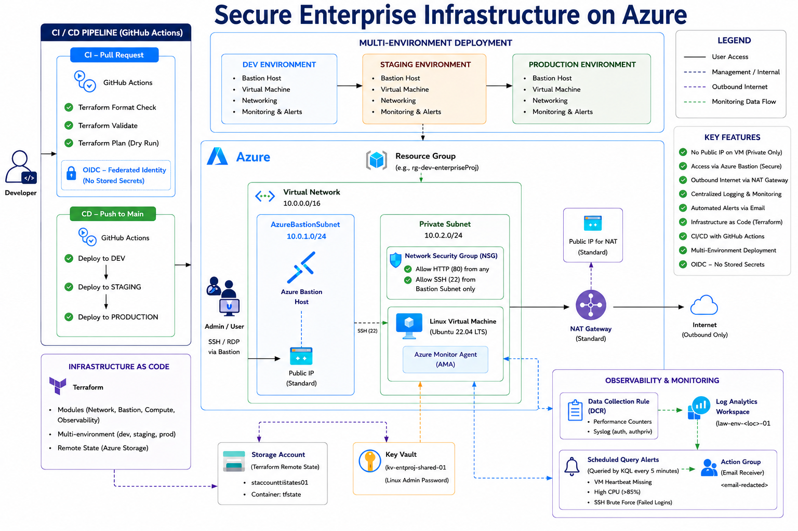

#  Secure Enterprise Infrastructure on Microsoft Azure

> Production-inspired Azure infrastructure built with Terraform, following Infrastructure as Code (IaC), security best practices, observability, and CI/CD automation.



---

##  Business Scenario

A growing company currently provisions its cloud infrastructure manually through the Azure Portal. As the organization expands, manual deployments become slow, inconsistent, and prone to configuration drift.

The company needs a secure, repeatable, and automated infrastructure platform that enables cloud engineers to deploy identical environments for Development, Staging, and Production while maintaining security, operational visibility, and controlled deployment processes.

This project demonstrates how Infrastructure as Code (IaC) using Terraform can solve these challenges by automating infrastructure provisioning, enforcing security best practices, and integrating monitoring and CI/CD.

---

## Business Problems

This project addresses several common operational challenges faced by organizations.

### Problem 1 — Manual Infrastructure Deployment

Engineers manually create Azure resources through the Azure Portal.

Result:

- inconsistent configurations
- human errors
- difficult disaster recovery
- configuration drift

**Solution:** Terraform provisions the complete infrastructure from reusable modules, ensuring every deployment is identical.

---

### Problem 2 — Publicly Exposed Virtual Machines

Many organizations expose Linux VMs directly to the Internet through SSH.

Risks include:

- brute-force attacks
- credential theft
- unauthorized access

**Solution:** The Linux VM resides inside a private subnet with **no Public IP**. Administrative access is provided securely through **Azure Bastion**.

---

### Problem 3 — Private Servers Still Need Internet Access

Although the VM should remain private, it still needs outbound Internet access to:

- download operating system updates
- install packages
- retrieve Azure agents

**Solution:** Azure NAT Gateway provides secure outbound-only Internet connectivity while preventing inbound access from the Internet.

---

### Problem 4 — Lack of Monitoring

Without centralized monitoring, engineers discover infrastructure problems only after users report outages.

**Solution:** Azure Monitor and Log Analytics continuously collect telemetry from the Linux VM. Alerts automatically notify administrators whenever predefined thresholds are exceeded.

---

### Problem 5 — Unsafe Infrastructure Changes

Infrastructure changes made directly in production increase operational risk.

**Solution:** GitHub Actions implements a CI/CD pipeline that validates Terraform code, generates execution plans, promotes infrastructure through Development and Staging, and requires manual approval before Production deployment.

---

## Solution Architecture


---

## Architecture Overview

The solution consists of the following components.

### Azure Networking

- Virtual Network (VNet)
- Azure Bastion Subnet
- Private Application Subnet
- Network Security Groups (NSGs)

The network isolates workloads while enforcing least-privilege communication between components.

### Secure Administration

Cloud engineers connect through Azure Bastion. The Linux virtual machine never receives a Public IP address, significantly reducing the attack surface.

### Outbound Connectivity

Azure NAT Gateway provides outbound Internet access for the private subnet, enabling the VM to install software, download updates, and communicate with Azure services without exposing itself publicly.

### Compute Layer

The environment contains a Linux Virtual Machine that represents the company's internal application server. Terraform automatically provisions the VM using reusable modules.

### Storage

Azure Storage Account stores Terraform remote state. Centralizing state enables collaborative Infrastructure as Code workflows.

### Monitoring

The observability platform includes Azure Monitor, Log Analytics Workspace, Azure Monitor Agent, Alert Rules, and Action Groups. These services continuously monitor infrastructure health and proactively notify administrators when issues occur.

### CI/CD Pipeline

**Continuous Integration** — every Pull Request automatically runs Terraform Format Check, Terraform Validate, and Terraform Plan, ensuring infrastructure changes are reviewed before merging.

**Continuous Deployment** — after merging into main:

```
Development → Staging → Manual Approval → Production
```

Only approved infrastructure changes are allowed into Production.

---

## Repository Structure

```text
terraform/
│
├── modules/
│   ├── bastion/
│   ├── compute/
│   ├── network/
│   ├── observability/
│   └── scripts/
│
├── env/
│   ├── dev.tfvars
│   ├── staging.tfvars
│   └── prod.tfvars
│
├── backend.tf
├── providers.tf
├── variables.tf
├── outputs.tf
└── main.tf

.github/
└── workflows/
    ├── ci-terraform.yml
    ├── cd-terraform.yml
    └── terraform-destroy.yaml
```

---

## Security Decisions

| Decision                   | Reason                           |
| -------------------------- | -------------------------------- |
| No Public IP on VM         | Reduces attack surface           |
| Azure Bastion              | Secure administrative access     |
| NAT Gateway                | Controlled outbound Internet     |
| NSGs                       | Least privilege networking       |
| Remote Terraform State     | Team collaboration               |
| Manual Production Approval | Prevent unauthorized deployments |

---

## Technologies Used

- Microsoft Azure
- Terraform
- GitHub Actions
- Azure Bastion
- Azure NAT Gateway
- Azure Virtual Network
- Azure Monitor
- Log Analytics Workspace
- Azure Storage Account
- Network Security Groups

---

## Skills Demonstrated

- Infrastructure as Code
- Azure Networking
- Cloud Security
- Identity and Access
- Linux Administration
- CI/CD Automation
- Infrastructure Monitoring
- Terraform Module Design
- Infrastructure Documentation

---

## Future Improvements

Potential enterprise enhancements include:

- Azure Key Vault integration
- Azure Firewall
- Private Endpoints
- Azure Policy
- Microsoft Defender for Cloud
- Availability Zones
- Load Balancer
- Auto Scaling
- Application Deployment Pipeline
- Disaster Recovery

---

## Lessons Learned

This project demonstrates how production-inspired Azure infrastructure can be automated using Infrastructure as Code.

Rather than manually provisioning resources through the Azure Portal, every infrastructure component is version-controlled, repeatable, auditable, and deployable through a CI/CD pipeline.

The project also reinforces security best practices by removing Public IP exposure from virtual machines, implementing least-privilege networking, enabling centralized monitoring, and introducing deployment approval gates before Production changes.

Although this is a portfolio project, the architecture closely reflects patterns commonly used by cloud engineering teams to build secure and maintainable Azure environments.
